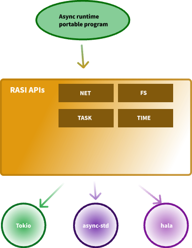

# RASI

The Rust Asynchronous System Interface (RASI) provides a unified API interface to Rust's asynchronous runtimes (such as tokio, async-std, etc.).

## Motivation

Now, Rust has various implementations of the `async runtime`, most of which are compatible with the official [`futures`](https://github.com/rust-lang/futures-rs), with the exception of [`tokio`](https://github.com/tokio-rs/tokio), which is a maverick.

However, simply using ***futures*** does not result in a runtime portable program.

For example, when you need to improve the performance of your application on the linux platform and try to replace tokio's default network mod implementation with [`io_uring`](https://www.wikiwand.com/en/Io_uring), you can't do it very easily.

This is because the ***futures*** library is missing several key abstractions:

* task
* network
* filesystem
* time
* rdbc

> `RASI` attempts to be a portable abstraction layer for asynchronous runtimes, either as a **decorator** for existing asynchronous runtimes or as a good starting point for newly developed asynchronous runtimes.

## SYSCALL

The `RASI` defines a set of `Syscalls` to fill in the missing abstractions in the `Futures` crate:

* [`Executor`](https://docs.rs/rasi-syscall/latest/rasi_syscall/trait.Executor.html) for working with asynchronous tasks.
* [`Network`](https://docs.rs/rasi-syscall/latest/rasi_syscall/trait.Network.html) primitives for TCP/UDP communication.
* [`FileSystem`](https://docs.rs/rasi-syscall/latest/rasi_syscall/trait.FileSystem.html)  manipulation operations.
* [`Timer`](https://docs.rs/rasi-syscall/latest/rasi_syscall/trait.Timer.html) Utilities for tracking time.

All of the above `Syscalls` can be implemented separately and injected into a runtime portable program. When replacing any of the system call modules, your program code does not need to be changed except for the `inject code`.

### Examples

Visit the [`reference implementation`](crates/default) of the syscall for more information.

> *Also, you can apply it to your portable programs as appropriate.*
